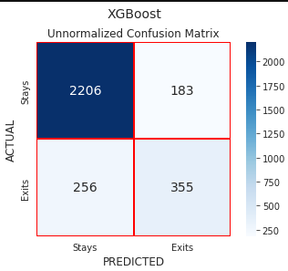
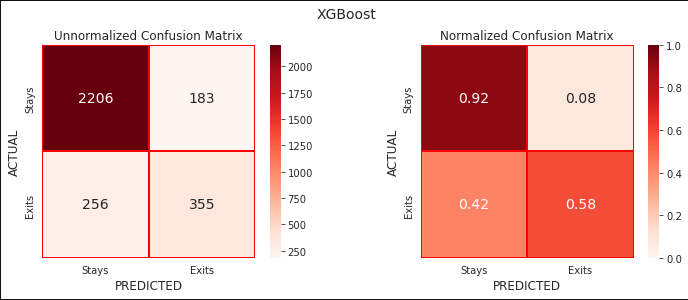

# Confusion Matrix Visualization

## **Work in Progress!!!**

Because Plotly does not render in GitHub, I have to use nbviewer. Plotly should render on nbviewer and in many cases is still interactive. Use these links to get properly rendered notebooks:

- [Confusion Matrix Visualization.ipynb](https://nbviewer.org/github/zunicd/Confusion-Matrix-Visualization/blob/main/Confusion%20Matrix%20Visualization.ipynb)
- [Confusion Matrix as Sankey Diagram.ipynb](https://nbviewer.org/github/zunicd/Confusion-Matrix-Visualization/blob/main/Confusion%20Matrix%20as%20Sankey%20Diagram.ipynb)

In machine learning a confusion matrix is a kind of a table that is used to understand how well our classification model predictions perform, typically a supervised learning. It helps us a lot in understanding the model behaviour and interpreting the results.  

In this project we will not discuss how to interpret a confusion matrix, that could be find [here](https://en.wikipedia.org/wiki/Confusion_matrix). Instead, we will present several ways of how to visualize a confusion matrix.

## Normalized vs. Unnormalized Matrix

Unnormalized Confusion Matrix:

```
[[1979  410]
 [ 198  413]]
```

Normalized Confusion Matrix:

```
[[0.83 0.17]
 [0.32 0.68]]
```


## Confusion Matrix Arrays 

```
[[1979  410]
 [ 198  413]]

[[0.83 0.17]
 [0.32 0.68]]
```


## Confusion Matrix Dataframes, Side by Side


  


## Single Confusion Matrix Heatmap


  


## Confusion Matrix Heatmaps, Side by Side

#### Unnormalized and normalized confusion matrix for one model:


 


#### Confusion matrices for 2 models, unnormalized or normalized


 


 

## Multiple Confusion matriX Heatmaps, in Two Columns


 


## Confusion Matrix as Sankey diagram


  
