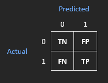
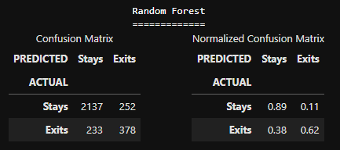
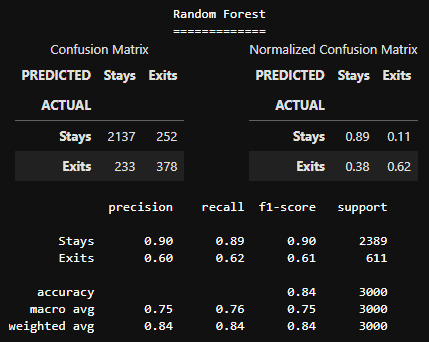
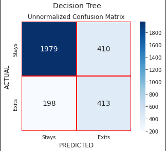
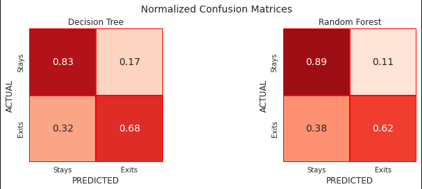
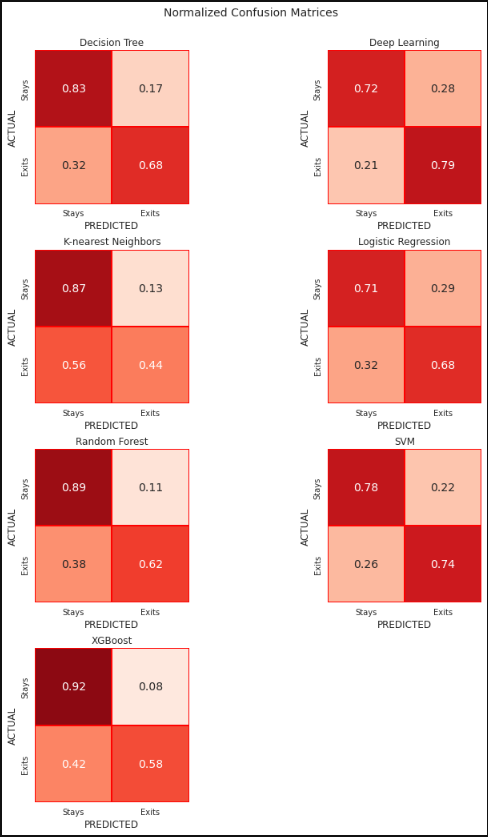
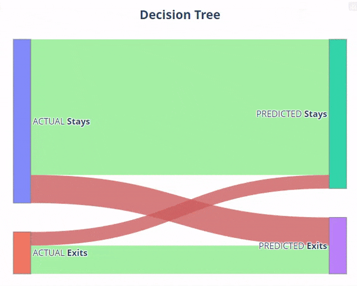

# Confusion Matrix Visualization

> For a deeper understanding of this project and to gain more insights, I encourage you to read the [accompanying article](https://damirzunic.com/the-story-about-confusion-matrix-visualization). The article provides additional context and explanations about the project's objectives, methodologies, and findings. It complements the notebooks and offers a comprehensive perspective on how to effectively interpret and visualize the confusion matrix in various ways. 

**NOTE:**

Please note that Plotly visualizations may not render on GitHub, but they should work perfectly on nbviewer, offering an interactive experience in many cases. To access properly rendered notebooks you can use the following links:

- [Confusion Matrix Visualization.ipynb](https://nbviewer.org/github/zunicd/Confusion-Matrix-Visualization/blob/main/Confusion%20Matrix%20Visualization.ipynb) - This notebook presents various visualization techniques for confusion matrices using a collection of helper functions.
- [Confusion Matrix as Sankey Diagram.ipynb](https://nbviewer.org/github/zunicd/Confusion-Matrix-Visualization/blob/main/Confusion%20Matrix%20as%20Sankey%20Diagram.ipynb) - This notebook guides you step by step through the process of creating an interactive Sankey confusion matrix using Plotly.


## Objective

In the domain of machine learning, a confusion matrix is a significant table used to evaluate the performance of our classification model, especially in supervised learning tasks. It serves as a valuable tool in understanding the behavior of the model and interpreting the prediction results.

However, in this project, we won't focus on interpreting the confusion matrix, as detailed information on that topic can be found [here](https://en.wikipedia.org/wiki/Confusion_matrix). Instead, our main objective is to present multiple techniques for visualizing a confusion matrix. To achieve this, we will create separate helper functions, each dedicated to a specific visualization method. By doing so, we aim to enhance the understanding and insights derived from the model's classification results in a more intuitive and visual manner.


## Results

To simplify the visualization of confusion matrices, I have created several helper functions in the [metrics_utilities.py](https://github.com/zunicd/Confusion-Matrix-Visualization/blob/main/scripts/metrics_utilities.py) module: 

- `cm_cr()` - displays unnormalized and normalized confusion matrix dataframes side by side, along with classification report if desired
- `plot_cm()` - plots one unnormalized or normalized confusion matrix heatmap
- `plot_cm_unnorm_and_norm()` - plots one model's confusion matrix heatmaps without and with normalization, side by side
- `plot_conf_matrices()` - plots heatmaps for normalized (default) or unnormalized confusion matrices for multiple models
- `plot_cm_sankey()` - creates an interactive confusion matrix using a Sankey diagram

The notebook [Confusion Matrix Visualization.ipynb](Confusion%20Matrix%20Visualization.ipynb) demonstrates the execution of these functions, showcasing how each visualization technique can be utilized to display and interpret the confusion matrix. By running the code provided in the notebook, you can observe the visual representations of the confusion matrix and gain valuable insights into the model's classification performance. The use of these helper functions streamlines the process of generating various visualizations and allows for a comprehensive exploration of the model's behavior and predictive capabilities.


## Axes Convention

In the literature, two common variants for representing samples in a confusion matrix exist:
1. each row of the matrix represents samples in an *actual* class, and each column represents samples in a *predicted* class
2. in the other variant, this arrangement is reversed, with each row representing samples in the *predicted* class and each column representing samples in the *actual* class.

In this project we will use the first variant, where *actual* labels are on the horizontal axes and *predicted* labels on the vertical axes. Let us consider a binary classification problem with two classes: `0` (*Negative*) and `1` (*Positive*). The confusion matrix would be:

 


## Normalized vs. Unnormalized Matrix

Since real-life data often tends to be imbalanced, using a confusion matrix without normalization might lead to misleading or improper conclusions. The *unnormalized confusion matrix* is shown at the top and the *normalized confusion matrix* at the bottom. The normalized matrix shows the percentage of predictions made by the model for each class with respect to the corresponding *actual* (*true*) label.

```
[[1979  410]
 [ 198  413]]

[[0.83 0.17]
 [0.32 0.68]]
```

Further down in this *readme*, we will present practical illustrations that demonstrate the significance of normalization in confusion matrices.

## Confusion Matrix Arrays

The simplest and most common way to display a confusion matrix is as a raw numbers array:
```
[[1979  410]
 [ 198  413]]
```
This does not look very visually appealing, and it is just a binary class example. For a multi-class classification problem, the confusion matrix becomes larger and more complex, making it harder to extract meaningful insights from the raw numbers alone.


## Confusion Matrix Dataframes - Side by Side

To make our confusion matrix more appealing, we can utilize a Pandas DataFrame, and display both, unnormalized and normalized, matrices side by side (function `cm_cr()`).   


<figure>

<figcaption><i>One model - unnormalized AND normalized (dataframes)</i></figcaption>
</figure>

&nbsp;

If desired, we can display the classification report just below these two matrices. This integrated visualization will offer a comprehensive overview of the model's performance.    


<figure>

<figcaption><i>Confusion matrices (dataframes) & classification report</i></figcaption>
</figure>


## Confusion Matrix as Seaborn Heatmap

I believe we can further enhance the interpretability of our visualizations by introducing a color palette. By employing a color-encoded matrix, we can make the confusion matrix easier to understand and analyze. 

To achieve this, we will utilize the Seaborn `heatmap()` function, which will enable us to represent the values in the confusion matrix using a gradient of colors. This color-coded approach will provide a more intuitive representation, allowing us to quickly identify patterns and assess the model's performance for different class labels.

Several functions were developed that can visualize confusion matrices for various numbers of models and supporting both normalized and unnormalized versions. The functions' versatility empowers us to efficiently compare and interpret classification results for different models, ensuring a comprehensive evaluation process regardless of the number of models or the chosen normalization approach.

### a. Single Confusion Matrix

`plot_cm()` - this function plots one model's confusion matrix, unnormalized or normalized, with normalized as default.

<figure>
 
<figcaption><i>One model - unnormalized</i></figcaption>
</figure>

### b. Confusion Matrices for 1 Model - Unnormalized AND Normalized

`plot_cm_unnorm_and_norm()` - plots one model's confusion matrix heatmaps without and with normalization, side by side.

This visual representation helps highlight the impact of normalization on the evaluation of the model's performance for each class, providing valuable insights at a glance.  

<figure>
 
<figcaption><i>One model - unnormalized AND normalized</i></figcaption>
</figure>

### c. Confusion Matrices for Multiple Models - Unnormalized OR Normalized

`plot_conf_matrices()` - this function plots confusion matrices for multiple models with normalized matrices as default. You can also choose the option to plot unnormalized matrices. 

<figure>
 
<figcaption><i>Two models - normalized</i></figcaption>
</figure>

&nbsp;

<figure>
 
<figcaption><i>Seven models - normalized</i></figcaption>
</figure>


## Confusion Matrix as Sankey Diagram

And finally, we can introduce another, more elegant and interactive way to visualize a confusion matrix - [Sankey Diagram](https://en.wikipedia.org/wiki/Sankey_diagram). To create our Sankey confusion matrix we used Python and Plotly. 

The notebook [Confusion Matrix as Sankey Diagram](Confusion%20Matrix%20as%20Sankey%20Diagram.ipynb) describes step-by-step the process of creating the function `plot_cm_sankey()`, which we use to display our confusion matrix as Sankey.  

&nbsp;

   

&nbsp;

### How to Interpret Sankey Confusion Matrix?

To interpret our Sankey confusion matrix, with **Stays** representing the negative class and **Exits** representing the positive class, take note of the following key elements:

- **Nodes:** The source nodes ("ACTUAL **Stays**" and "ACTUAL **Exits**" ) are positioned on the left, representing the *actual* class labels. The target nodes ("PREDICTED **Stays**" and "PREDICTED **Exits**") are on the right, representing the *predicted* class labels.
- **Node Size:** The size of each node is proportional to the number of samples belonging to that specific class, offering insights into the class distribution.
- **Links:** The links between nodes show the flow of samples during classification. Wider links indicate a higher number of samples classified correctly (shown in green) or incorrectly (depicted in red) between the respective class labels.
- **Tooltips:** Hovering over the nodes and links provides additional information, displaying the numerical and textual representation of the confusion matrix. This interactive feature enhances the understanding of classification outcomes and allows for a more detailed examination of the model's performance.

## Tools /  Techniques Used

- Python
- JupyterLab
- Pandas
- Numpy
- Seaborn - Heatmap
- Plotly - Sankey Diagram


## References

- [Understanding the Confusion Matrix from Scikit learn](https://towardsdatascience.com/understanding-the-confusion-matrix-from-scikit-learn-c51d88929c79)
- [(Visually) Interpreting the confusion-matrix](https://medium.com/analytics-vidhya/visually-interpreting-the-confusion-matrix-787a70b65678)
- [Plotly - Displaying Figures using Plotly's Python graphing library](https://plotly.com/python/renderers/#displaying-figures)
- [Plotly - Sankey Diagram in Python](https://plotly.com/python/sankey-diagram/#basic-sankey-diagram)

## Acknowledgements

I would like to thank Avi Chawla for his post [Enrich Your Confusion Matrix With A Sankey Diagram](https://www.blog.dailydoseofds.com/p/enrich-your-confusion-matrix-with) that inspired me to study more about Sankey diagrams and add Sankey visualization of a confusion matrix to this project.

## License

This project is licensed under the MIT License - see the [LICENSE](LICENSE) file for details.

